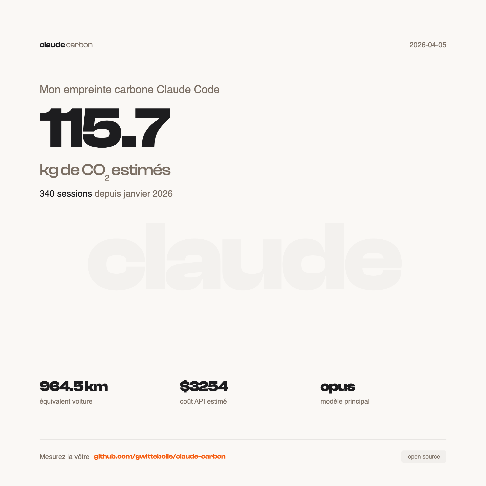

# claude-carbon

Track the carbon footprint of your Claude Code sessions.

```
🟢 Opus 4.6 (1M context) ░░░░ 6% | $3.20 | 145g CO₂ | claude cowork
```

## What it does

- Adds a live CO2 estimate to the Claude Code status line, next to the session cost
- Persists each session to a local SQLite database
- Backfills historical data from existing `~/.claude` transcripts
- Generates shareable PNG report cards for LinkedIn
- Exposes a `/claude-carbon:report` skill for a full emissions breakdown

## Example report

<p align="center">
  
</p>

Generate yours:

```bash
# Since January 1st (default)
bash scripts/generate-report.sh

# Since a specific date
bash scripts/generate-report.sh --since 2026-03-01

# All time
bash scripts/generate-report.sh --all
```

Exports two PNGs to `exports/`: a summary card and a detailed card with per-project breakdown.

## Install

```bash
git clone https://github.com/gwittebolle/claude-carbon.git ~/code/claude-carbon
bash ~/code/claude-carbon/scripts/setup.sh
```

The setup script checks dependencies, creates the SQLite database, backfills your existing Claude Code sessions, and prints the total CO2 emitted so far.

Then add to `~/.claude/settings.json` (or `settings.local.json`):

```json
{
  "statusLine": {
    "type": "command",
    "command": "~/code/claude-carbon/scripts/statusline.sh"
  }
}
```

And add the Stop hook to persist sessions (append to your existing `hooks.Stop` array):

```json
{
  "type": "command",
  "command": "~/code/claude-carbon/scripts/persist-session.sh"
}
```

Restart Claude Code. The CO2 estimate appears in the status line.

## Commands

| Command | What it does |
|---------|-------------|
| `setup.sh` | Init database, backfill historical sessions, show total |
| `statusline.sh` | Status line script (called automatically by Claude Code) |
| `persist-session.sh` | Stop hook (saves session data on exit) |
| `backfill.sh` | Re-parse all historical JSONL transcripts |
| `generate-report.sh` | Export shareable PNG report cards |
| `/claude-carbon:report` | In-session text report with totals, equivalences, top sessions |

## Emission factors

Factors from [Jegham et al. 2025](https://arxiv.org/abs/2505.09598), a peer-reviewed study measuring energy consumption of LLM inference on AWS infrastructure.

| Model | Input (gCO2e/Mtok) | Output (gCO2e/Mtok) | Basis |
|-------|--------------------|--------------------|-------|
| Opus | 500 | 3000 | Extrapolated (3x Sonnet) |
| Sonnet | 190 | 1140 | Measured |
| Haiku | 95 | 570 | Extrapolated (0.5x Sonnet) |

These are order-of-magnitude estimates, not precise measurements. Factors are editable in `data/factors.json`. See [METHODOLOGY.md](METHODOLOGY.md) for the full scientific basis, formula, limitations, and equivalences.

## Dependencies

- `jq` - JSON parsing
- `sqlite3` - local database
- `playwright-core` - PNG export only (optional)

`jq` and `sqlite3` are pre-installed on macOS. On Linux: `apt install jq sqlite3`.

## Why

Every Claude Code session uses real compute, real energy, real emissions. The number is small per query, but it adds up. Making it visible is the first step to owning it.

## Open source

claude-carbon is free and open source under the [MIT license](LICENSE). Contributions welcome.

Built by [Gaetan Wittebolle](https://github.com/gwittebolle).
